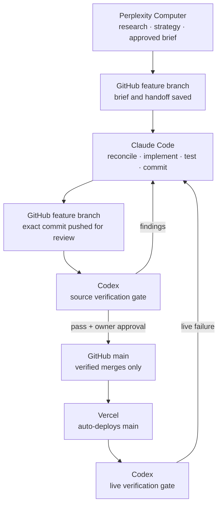

# Agentic Handshake

A GitHub-centered handoff protocol for running long-lived builds across multiple AI agents without losing context, duplicating work, or leaking private files.

Built and used in production by [Rose Laguana](https://roselaguana.vercel.app) to coordinate Perplexity Computer, Claude Code, and a Codex verification lane across real projects, with GitHub as the shared memory and checkpoint layer throughout and Vercel as the deployment surface.

## The problem

AI agents are powerful, but long-running work breaks when context gets trapped inside separate chat threads, CLI sessions, or tool-specific memory. Without a shared source of truth, one agent can duplicate work, miss prior decisions, expose private files, or re-plan something that already shipped.

Chat memory does not survive across tools. Repo files do.

## The protocol

Every project carries three documentation surfaces, versioned in git alongside the code:

| File | Role |
|---|---|
| `README.md` | The public project story: what it is, why it exists, how it runs |
| `HANDOFF.md` | The baton pass: current state, what changed, unfinished work, next-agent instructions |
| `AGENTS.md` | The standing rulebook: privacy defaults, truth standards, workflow and deployment rules |

A note on lineage: `AGENTS.md` follows the open convention of the same name ([agents.md](https://agents.md)), which many coding agents now read natively. The Agentic Handshake is not that convention; it is a specific protocol built on top of it: the handoff loop, the reconcile rules, and the verification discipline described below.

Agents read these before touching anything. The loop:

Codex has two gates: source verification of the exact feature-branch commit before merge to main, and live verification of the deployed URL after. Codex is a verification lane, not a co-implementation lane: it reports findings and identifies the verified commit SHA, while the implementation agent owns remediation. Any implementation change after a pass invalidates the pass.

## The rules that make it work

1. **No handoff runs verbatim.** The receiving agent reconciles the handoff against actual repo state before executing. Specs are written by one agent and checked by another; both can be wrong, and the diff between them is where errors hide.
2. **Documentation is part of the change, not an afterthought.** A task is not done until `HANDOFF.md` reflects the new state. The next agent starts from the file, not from a memory of the conversation.
3. **Private by default.** Repos start private. Anything public passes a truth-and-privacy review first: claims must be accurate, and operating docs must never reach a public surface. If the host serves raw repo files, exclude the operating docs from deployment explicitly.
4. **Verify on the surface people actually visit.** A deploy tool reporting success is a claim, not a verification. Check the live URL for what must be there, and for what must not.

## Does it work?

In production use, the reconcile step has caught real errors before they shipped, including a handoff whose verbatim commands would have published a private operating doc to a public URL, and a "correction" based on a stale config file that a live check proved wrong. Both were trapped by rule 1: no handoff runs verbatim.

## Use it yourself

Two templates, ready to adapt:

- [`AGENTS.template.md`](AGENTS.template.md) sets the standing rules for any repo AI agents work in
- [`HANDOFF.template.md`](HANDOFF.template.md) structures the baton pass between sessions and tools

Copy them into your repo as `AGENTS.md` and `HANDOFF.md`, fill in the placeholders, and tell every agent to read them first. If your repo auto-deploys to static hosting, exclude both files from the deployment before your first push.

## License

MIT. Use it, adapt it, ship with it.
